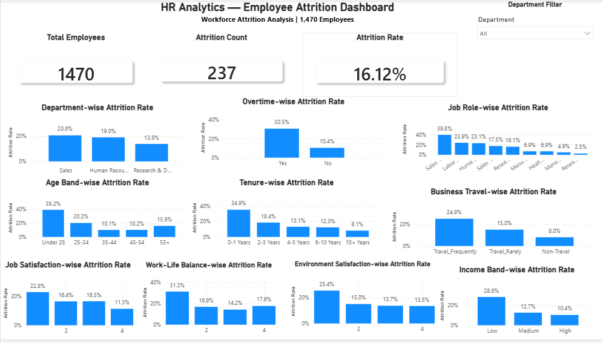

# HR Analytics — Employee Attrition Analysis

End-to-end HR analytics project analyzing employee attrition using Excel, Python, SQL and Power BI.

---

## Project Overview

This project analyzes employee attrition patterns to identify workforce segments with higher observed attrition and provide data-driven retention insights.

The analysis focuses on employee demographics, departments, job roles, overtime, tenure, business travel, income, satisfaction and other workforce-related factors.

---

## Dataset

- **Employees:** 1,470
- **Columns:** 35
- **Target Variable:** Attrition
- **Missing Values:** 0
- **Duplicate Rows:** 0

---

## Tools & Workflow

### Tools Used

- **Excel** — Data preparation and initial analysis
- **Python** — Exploratory Data Analysis (EDA)
- **SQL** — Workforce and attrition analysis
- **Power BI** — Interactive dashboard and visualization

### Analysis Workflow

1. Data Collection & Understanding
2. Data Cleaning
3. Exploratory Data Analysis
4. SQL Analysis
5. Power BI Dashboard Development
6. Business Insights & Recommendations

---

## Key Findings

- Overall observed attrition rate: **16.12%**
- Overtime employees show a higher observed attrition rate (**30.53%**) than non-overtime employees (**10.44%**).
- Sales Representatives have the highest observed attrition rate among job roles (**39.8%**).
- Employees under 25 show the highest observed attrition among age groups (**39.2%**).
- Employees with 0–1 years at the company show higher observed attrition (**34.9%**).
- Frequent business travelers show higher observed attrition (**24.9%**).
- Lower job satisfaction is associated with higher observed attrition.
- Lower environment satisfaction is associated with higher observed attrition.
- Employees with low work-life balance show higher observed attrition.
- The Sales department has the highest observed attrition rate among departments (**20.63%**).

---

## Business Recommendations

Based on the analysis, the following areas can be prioritized for employee retention:

1. **Overtime Management** — Review workload, overtime patterns and employee support initiatives.
2. **Role-Specific Retention** — Focus on higher-attrition job roles and review workload, career growth and support.
3. **Early-Career Retention** — Strengthen onboarding, mentoring, career development and regular check-ins.
4. **Travel & Workforce Support** — Monitor frequent-travel employees and review travel workload and support.
5. **Compensation & Career Growth** — Review lower-income segments, salary growth and career progression opportunities.
6. **Employee Satisfaction** — Strengthen feedback, recognition, engagement and development initiatives.
7. **Work-Life Balance** — Review workload, scheduling, overtime and employee support.
8. **Department-Level Retention** — Prioritize higher-attrition departments and review department-specific workforce needs.

---

## Power BI Dashboard

The Power BI dashboard provides an interactive view of employee attrition across key workforce dimensions.

### Dashboard Includes

- Total Employees
- Attrition Count
- Attrition Rate
- Department-wise Attrition
- Job Role-wise Attrition
- Overtime-wise Attrition
- Age Band-wise Attrition
- Tenure-wise Attrition
- Business Travel-wise Attrition
- Income Band-wise Attrition
- Job Satisfaction
- Environment Satisfaction
- Work-Life Balance

### Dashboard Preview



---

## Project Structure

```text
data/
excel/
python/
sql/
powerbi/
images/
reports/
README.md
```
---

## Documentation

This project follows a complete end-to-end data analytics workflow:

- **Data Preparation** — Excel
- **Exploratory Data Analysis** — Python
- **Data Analysis** — SQL
- **Dashboard Development** — Power BI
- **Business Insights** — Data-driven findings and recommendations

All project files are organized by tool and workflow stage inside the repository.

---

## Author

**Md. Javed Ali**  
Data Analyst | Bangladesh

- **Portfolio:** https://javedali-analytics.github.io/portfolio/
- **LinkedIn:** https://www.linkedin.com/in/Javedali-analytics
- **GitHub:** https://github.com/Javedali-analytics
